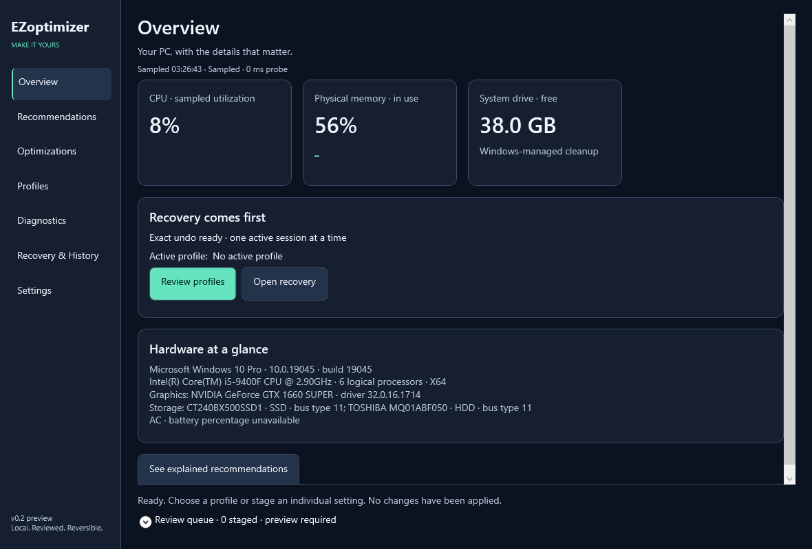

# EZoptimizer

A native Windows app for setting up a PC around your workload. Choose a conservative profile, review the exact changes, and keep a clear path back to your original settings.



**New in v0.3.0:** logo-free styling, 15 reversible preference controls, optional reduced-motion profiles, gaming readiness, frame-time CSV comparisons and coding workspace inspection. [See the design update](docs/REDESIGN.md).

## Download

Get **EZoptimizer.exe** from [Releases](https://github.com/eyad1dk/EZoptimizer/releases). The portable x64 build includes .NET 10; no installer or separate runtime is needed. This is an **unsigned preview**, not a signed production release.

Open Profiles, stage Gaming, Coding, Everyday, Quiet or Battery Saver, then expand the review queue. Click **Preview exact changes**, inspect the before/after values, and click **Apply reviewed changes**. Undo the active session in **Recovery & History** before trying another batch.

Gaming and Coding start with reduced animation and Balanced power. Quiet and Battery Saver prefer an installed Power saver plan. Missing plans are skipped. Presets change desktop preferences and a power plan; they do not change game files or compiler flags, and they do not guarantee faster games or builds.

## What works

- Seven native pages with dark, light, Windows-following and high-contrast themes.
- Timestamped CPU, memory and free-space readings, short trends and cached hardware inventory. A missing CPU baseline is shown as warming up.
- Explained recommendations based on observed pressure, battery state and workload tradeoffs.
- Fifteen reversible controls: native visual effects, dragging behavior, submenu delay, pointer speed, keyboard repeat preferences and an installed power plan. Selection only stages a value.
- A persistent desired-value queue, fresh previews, per-write revalidation, verification, cancellation and compensating undo after failure.
- Versioned recovery records, migration of v0.1 history, malformed-file quarantine and conflict-preserving retry.
- Five built-in profiles and validated custom profile import/export. Profiles cannot contain scripts or arbitrary commands.
- An opt-in session for an explicitly selected running game. It uses reviewed settings and attempts exact restoration on process exit or normal app exit. A crash leaves its journal for manual recovery.
- Read-only process, startup, registered-application, adapter and DNS inventories; user-selected bounded ICMP measurements.
- Frame-time CSV baseline/comparison with average FPS, slowest-1% FPS and p95/p99 frame times; bounded read-only coding-folder inspection and display/power readiness.
- Local before/after CPU/RAM sampling with workload context. These measurements do not stand in for FPS, frame time, input latency or build completion time.
- Session keep-awake, Windows Settings shortcuts, reviewed diagnostic export and rotating redacted local logs.
- Supplementary Windows restore-point inspection and a separately reviewed creation operation. Only that operation requests UAC.
- Manual stable/preview update checks against this repository. Installation stays manual until a publisher signing trust chain exists.

Privacy, gaming, network, debloat and maintenance include clearly labeled Windows shortcuts where no tested reversible mutation contract is available. No package removal or permanent cleanup is bundled into profiles. See the [feature matrix](docs/FEATURES.md) for implemented controls, diagnostics and deferrals.

## Recovery and privacy

History remains in `%LOCALAPPDATA%\EZoptimizer\history`; preserve it across upgrades. The app saves and flushes originals before changing Windows, verifies writes and retains unresolved recovery state. Undo leaves external changes intact. Malformed records are quarantined; readable sessions still recover independently, and new batches are blocked until the unknown history is reviewed.

`EZoptimizer.exe --recovery` opens recovery without dashboard probes. System Restore supplements exact undo; it is not a personal-file backup. Read [recovery guidance](docs/RECOVERY.md) before editing or removing history.

There is no telemetry, account, background service or automatic upload. Reports omit user paths, command lines, process/startup names, network identities, profile names and original setting values by default. You review the report before saving it. Update checks contact GitHub only when clicked; endpoint tests contact only the endpoint you enter.

## Compatibility and validation

The current local reference host is Windows 10 Pro 22H2 x64, build 19045, with a Core i5-9400F and GTX 1660 SUPER. Its ESU enrollment is unknown. Use an OS eligible for security servicing. Windows 11, managed/OEM laptops, real System Restore creation and mutating game-session tests still require disposable VM/hardware validation. ARM64 packaging is deferred.

The v0.3.0 build passes 51 simulated regression checks and read-only native smoke/preview checks. All seven pages are laid out across four themes and 100/150/200% emulated scaling. Built-in WPF renders use actual local readings; native desktop screenshot capture timed out. Full Narrator, keyboard traversal, actual OS high-contrast/DPI transitions and Windows 11 validation remain open. See [validation and measured overhead](docs/VALIDATION.md); no universal performance claim is made.

## Build

Use the .NET 10 SDK on Windows:

```powershell
dotnet build src/ForgePC/ForgePC.csproj -c Release
dotnet run --project tests/ForgePC.Tests/ForgePC.Tests.csproj -c Release
dotnet publish src/ForgePC/ForgePC.csproj -c Release -r win-x64 --self-contained true -p:PublishSingleFile=true -p:IncludeNativeLibrariesForSelfExtract=true -p:DebugType=None -p:DebugSymbols=false -o artifacts
$check = Start-Process artifacts/EZoptimizer.exe -ArgumentList '--smoke-test' -WindowStyle Hidden -Wait -PassThru
$check.ExitCode
artifacts/EZoptimizer.exe --render-preview overview.png
artifacts/EZoptimizer.exe --ui-check ui-checks.json
```

The original `ForgePC` namespace is retained. System.Management is the only added package. The [architecture notes](docs/ARCHITECTURE.md) explain the boundaries. Default checks never mutate Windows settings; mutating integration tests belong in disposable VMs with snapshots.

The release workflow now targets .NET 10. GitHub Actions execution on this account is currently blocked by an account/billing restriction; this release was built and checked locally. Do not interpret the workflow file as a passing hosted run.

## Contribute

Read [CONTRIBUTING.md](CONTRIBUTING.md) and [SECURITY.md](SECURITY.md). Report reproducible behavior and measurements, not promised tweak counts. MIT licensed.
