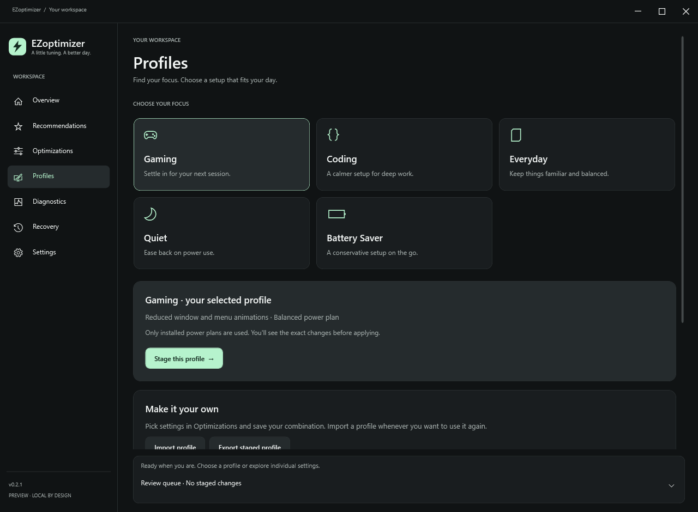
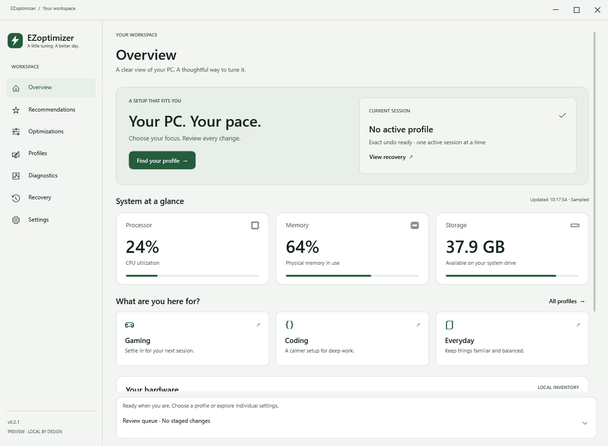

# A calmer workspace · v0.2.1

The interface now uses charcoal surfaces, a soft mint accent, a clearer type scale and consistent spacing. The dashboard leads with the current session, three compact system readings and quick entry points for Gaming, Coding and Everyday.

Profiles are selectable cards with short descriptions and a separate staging action. Selecting a card never applies a Windows setting.

The sidebar uses native glyphs and collapses to an icon rail in narrower windows. Cards flow to fewer columns, navigation scrolls, and the review area adapts to the available height. The window frame, inputs, buttons, menus, scrollbars and expandable sections share the same design. The executable has a matching original icon.

Light, Windows-following and high-contrast themes remain available. These images are built-in WPF renders of the app with real local readings, not browser mockups or fabricated hardware data.

The release build, portable read-only smoke check, 39 regression checks and 84 theme/page/scaling layouts pass. Layout checks include responsive card bounds. Hands-on Narrator, full keyboard traversal, actual OS DPI/high-contrast transitions and custom window-frame behavior across Windows versions still need manual coverage; see [validation](VALIDATION.md).

This update changes presentation and profile navigation. It keeps the same three supported setting controls and the existing journal/preview/undo engine.
